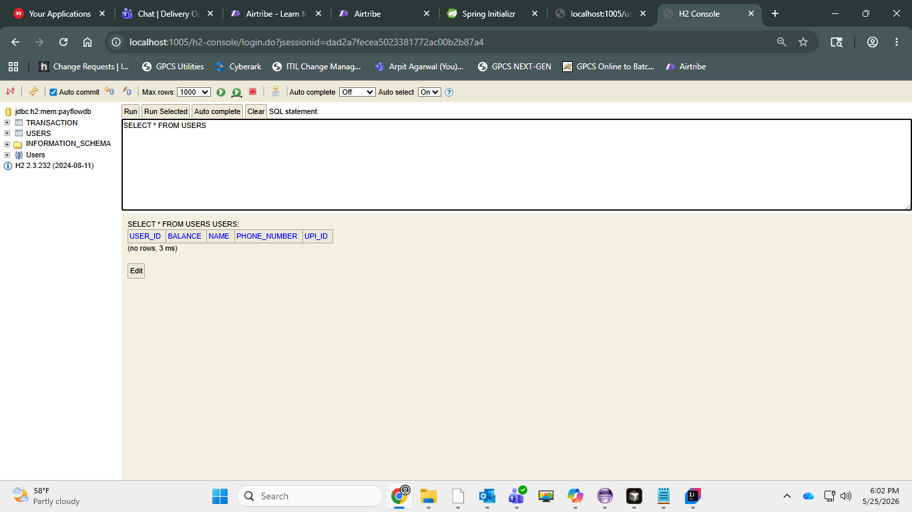
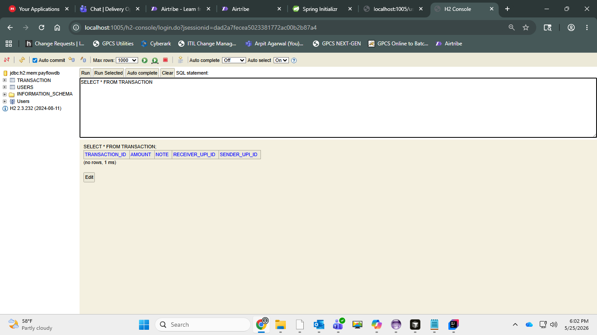
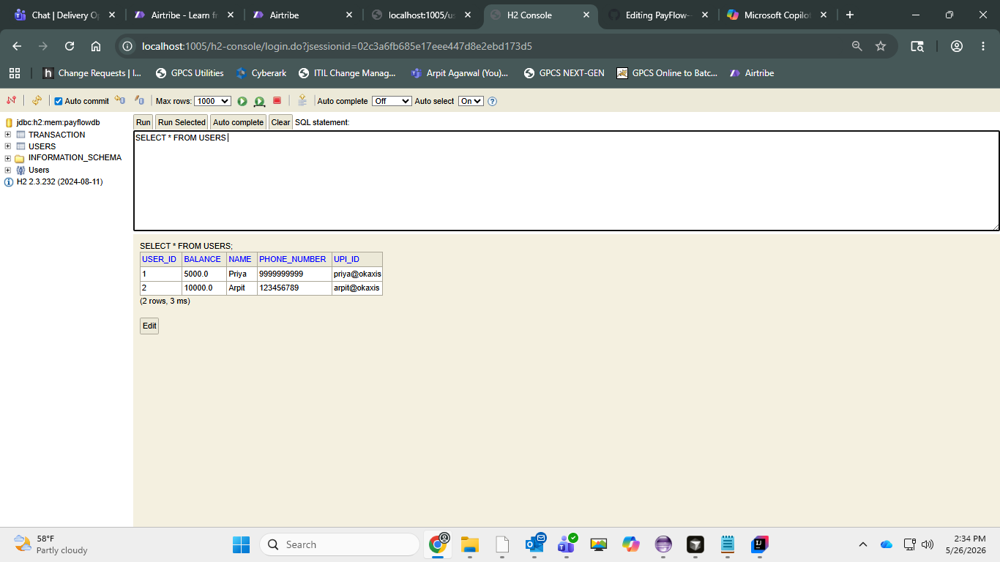
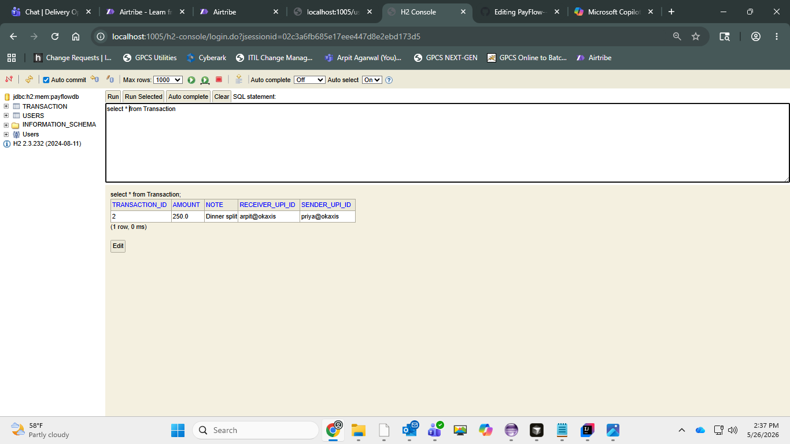

PayFlow API (Spring Boot + JPA + H2)
PayFlow is a simplified fintech backend (like PhonePe / Google Pay) built as a database-backed REST API.
It supports registering users with a wallet balance and recording money transfers between users. There is no UI — everything works via HTTP requests (curl/Postman).

✅ Tech Stack

Java (17 recommended)
Spring Boot
Spring Web (REST API)
Spring Data JPA (ORM + repositories)
H2 Database (in-memory database)
Lombok (removes boilerplate getters/setters/constructors)

✅ Project Structure (Packages)
src/main/java/com/payflow
 ├── controller
 ├── service
 ├── repository
 └── entity

What each layer does

entity: JPA entity classes (User, Transaction) mapped to database tables.
repository: Data access layer (JpaRepository) — provides CRUD and custom queries.
service: Business/service layer — contains application logic and calls repositories.
controller: REST layer — exposes HTTP endpoints and delegates to services.

✅ How to Run
1) Clone
Shellgit clone <your-repo-url>cd payflow-api
2) Run the application
Shellmvn spring-boot:run
App runs on:
http://localhost:1005

Port is set to 1005 using server.port=1005.

✅ Spring Boot Features in this Project (3 features)
1) Embedded Server
Spring Boot runs the application using an embedded Tomcat server, so no external server setup is required.
When you run mvn spring-boot:run, the server starts automatically on port 1005.
2) Auto-Configuration
Based on dependencies (Web, JPA, H2), Spring Boot automatically configures:

DispatcherServlet and MVC setup
DataSource connection for H2
Hibernate/JPA integration

3) Production-ready Defaults
Spring Boot provides sensible defaults like:

standard logging
default error responses (e.g., 404/500 JSON errors)
automatic JSON serialization/deserialization using Jackson

✅ Configuration (application.properties)
server.port=1005

spring.h2.console.enabled=true
spring.h2.console.path=/h2-console
spring.datasource.url=jdbc:h2:mem:payflowdb
spring.datasource.username=sa
spring.datasource.password=
spring.jpa.show-sql=true
spring.jpa.hibernate.ddl-auto=update
spring.jpa.properties.hibernate.format_sql=true

✅ Database (H2 Console)
Open H2 console
URL: http://localhost:1005/h2-console

Login details:

JDBC URL: jdbc:h2:mem:payflowdb
Username: user
Password: user

Tables

USERS
TRANSACTION

Run:
SQLSHOW TABLES;
SELECT * FROM USERS;
SELECT * FROM TRANSACTION;

✅ Task 2: Auto-generated CREATE TABLE SQL (Paste from console)
On first startup, Hibernate generates SQL to create tables automatically (no manual SQL).
Paste the two CREATE TABLE statements here:
USERS table create statement
Hibernate: 
    create table users (
        user_id bigint generated by default as identity,
        balance float(53) not null,
        name varchar(255) not null,
        phone_number varchar(255),
        upi_id varchar(255) not null,
        primary key (user_id)
    )
TRANSACTIONS table create statementHibernate: 
    create table transaction (
        transaction_id bigint generated by default as identity,
        amount float(53) not null,
        note varchar(140),
        receiver_upi_id varchar(255) not null,
        sender_upi_id varchar(255) not null,
        primary key (transaction_id)
    )
   
✅ Entities
User Entity
User represents a wallet owner with a UPI ID and balance.
Fields:

id (auto-generated primary key)
name
upiId (unique)
phoneNumber (optional, unique)
balance

JPA converts camelCase fields like upiId to snake_case column names like upi_id depending on naming strategy.

Transaction Entity
Transaction represents a money transfer record.
Fields:

id
senderUpiId
receiverUpiId
amount
note (optional)

For this assignment, we store sender/receiver UPI IDs as plain strings. Foreign key relationships will be added in a later session.

✅ Task 3: Repository Layer
UserRepository

Extends JpaRepository<User, Long>
Derived query method:

findByUpiId(String upiId)

TransactionRepository

Extends JpaRepository<Transaction, Long>

✅ Derived Query: findByUpiId explanation (Task 3)
Spring Data JPA derives SQL from repository method names.
findByUpiId(String upiId) gets translated into a query that filters by the upiId field.
SQL generated by JPA (paste from console after calling the endpoint)
SQL[PASTE GENERATED SQL FOR findByUpiId HERE]Show more lines
How JPA derives the query

findBy tells Spring Data to generate a SELECT query.
UpiId matches the entity field upiId.
Spring automatically builds a predicate: where upi_id = ?

What does ? mean?
? is a placeholder parameter. When you call the method at runtime, JPA safely binds the actual UPI ID value into the query (prevents injection and keeps SQL reusable).

✅ REST API Endpoints (Task 5)
Base URLs

Users: /users
Transactions: /transactions

✅ Testing with curl (Task 5)

Replace values as needed. All commands assume server running on port 1005.

1) Register a user — POST /users
   curl -Method POST "http://localhost:1005/users" -Headers @{ "Content-Type" = "application/json" } -Body '{"name":"Priya","upiId":"priya@okaxis","phoneNumber":"9999999999","balance":5000}'

StatusCode        : 200
StatusDescription :
Content           : {"userId":1,"name":"Priya","upiId":"priya@okaxis","balance":5000.0,"phoneNumber":"9999999999"}
RawContent        : HTTP/1.1 200
                    Transfer-Encoding: chunked
                    Keep-Alive: timeout=60
                    Connection: keep-alive
                    Content-Type: application/json
                    Date: Tue, 26 May 2026 08:46:31 GMT

                    {"userId":1,"name":"Priya","upiId":"pr...
Forms             : {}
Headers           : {[Transfer-Encoding, chunked], [Keep-Alive, timeout=60], [Connection, keep-alive], [Content-Type, application/json]...}
Images            : {}
InputFields       : {}
Links             : {}
ParsedHtml        : mshtml.HTMLDocumentClass
RawContentLength  : 94

2) Register second user — POST /users
curl -Method POST "http://localhost:1005/users" -Headers @{ "Content-Type" = "application/json" } -Body '{"name":"Arpit","upiId":"arpit@okaxis","phoneNumber":"123456789","balance":10000}' 

StatusCode        : 200
StatusDescription :
Content           : {"userId":2,"name":"Arpit","upiId":"arpit@okaxis","balance":10000.0,"phoneNumber":"123456789"}
RawContent        : HTTP/1.1 200
                    Transfer-Encoding: chunked
                    Keep-Alive: timeout=60
                    Connection: keep-alive
                    Content-Type: application/json
                    Date: Tue, 26 May 2026 08:52:15 GMT

                    {"userId":2,"name":"Arpit","upiId":"ar...
Forms             : {}
Headers           : {[Transfer-Encoding, chunked], [Keep-Alive, timeout=60], [Connection, keep-alive], [Content-Type, application/json]...}
Images            : {}
InputFields       : {}
Links             : {}
ParsedHtml        : mshtml.HTMLDocumentClass
RawContentLength  : 94

3) List all users — GET /users
curl http://localhost:1005/users

StatusCode        : 200
StatusDescription :
Content           : [{"userId":1,"name":"Priya","upiId":"priya@okaxis","balance":5000.0,"phoneNumber":"9999999999"},{"userId":2,"name":"Arpit","upiId":"arpit 
                    @okaxis","balance":10000.0,"phoneNumber":"123456789"}]
RawContent        : HTTP/1.1 200
                    Transfer-Encoding: chunked
                    Content-Type: application/json
                    Date: Tue, 26 May 2026 08:53:44 GMT

                    [{"userId":1,"name":"Priya","upiId":"priya@okaxis","balance":5000.0,"phoneNumber":"999...
Forms             : {}
Headers           : {[Transfer-Encoding, chunked], [Content-Type, application/json], [Date, Tue, 26 May 2026 08:53:44 GMT]}
Images            : {}
InputFields       : {}
Links             : {}
ParsedHtml        : mshtml.HTMLDocumentClass
RawContentLength  : 191

4) Get user by ID — GET /users/{id}
PS C:\payFlow> curl http://localhost:1005/users/1

StatusCode        : 200
StatusDescription :
Content           : {"userId":1,"name":"Priya","upiId":"priya@okaxis","balance":5000.0,"phoneNumber":"9999999999"}
RawContent        : HTTP/1.1 200
                    Transfer-Encoding: chunked
                    Content-Type: application/json
                    Date: Tue, 26 May 2026 08:55:22 GMT

                    {"userId":1,"name":"Priya","upiId":"priya@okaxis","balance":5000.0,"phoneNumber":"9999...
Forms             : {}
Headers           : {[Transfer-Encoding, chunked], [Content-Type, application/json], [Date, Tue, 26 May 2026 08:55:22 GMT]}
Images            : {}
InputFields       : {}
Links             : {}
ParsedHtml        : mshtml.HTMLDocumentClass
RawContentLength  : 94

5) Send money (record transaction) — POST /transactions
PS C:\payFlow> curl -Method POST "http://localhost:1005/transactions" -Headers @{ "Content-Type" = "application/json" } -Body '{"senderUpiId":"priya@okaxis","receiverUpiId":"arpit@okaxis","amount":250,"note":"Dinner split"}' 

StatusCode        : 200
StatusDescription :
Content           : {"transactionId":2,"senderUpiId":"priya@okaxis","receiverUpiId":"arpit@okaxis","amount":250.0,"note":"Dinner split"}
RawContent        : HTTP/1.1 200
                    Transfer-Encoding: chunked
                    Keep-Alive: timeout=60
                    Connection: keep-alive
                    Content-Type: application/json
                    Date: Tue, 26 May 2026 09:07:00 GMT

                    {"transactionId":2,"senderUpiId":"priy...
Forms             : {}
Headers           : {[Transfer-Encoding, chunked], [Keep-Alive, timeout=60], [Connection, keep-alive], [Content-Type, application/json]...}
Images            : {}
InputFields       : {}
Links             : {}
ParsedHtml        : mshtml.HTMLDocumentClass
RawContentLength  : 116

✅ H2 Console Screenshots (Task 2 & Task 5)
Before inserting data (Task 2)

Screenshot output of:

SQLSELECT * FROM USERS;SELECT * FROM TRANSACTIONS;

After inserting users + transaction (Task 5)
Run:
SQLSELECT * FROM USERS;SELECT * FROM TRANSACTIONS;

✅ Task 5: Demonstrate @RequestBody vs Without
With @RequestBody
When @RequestBody is present, Spring reads the JSON body and converts it into a User object (via Jackson). Inside controller logging/debugging you will see populated fields.
Example debug output (WITH @RequestBody):
curl -Method POST "http://localhost:1005/users" -Headers @{ "Content-Type" = "application/json" } -Body '{"name":"Priya","upiId":"priya@okaxis","phoneNumber":"9999999999","balance":5000}'

StatusCode        : 200
StatusDescription :
Content           : {"userId":1,"name":"Priya","upiId":"priya@okaxis","balance":5000.0,"phoneNumber":"9999999999"}
RawContent        : HTTP/1.1 200
                    Transfer-Encoding: chunked
                    Keep-Alive: timeout=60
                    Connection: keep-alive
                    Content-Type: application/json
                    Date: Tue, 26 May 2026 09:43:07 GMT

                    {"userId":1,"name":"Priya","upiId":"pr...
Forms             : {}
Headers           : {[Transfer-Encoding, chunked], [Keep-Alive, timeout=60], [Connection, keep-alive], [Content-Type, application/json]...}
Images            : {}
InputFields       : {}
Links             : {}
ParsedHtml        : mshtml.HTMLDocumentClass
RawContentLength  : 94

Without @RequestBody
When @RequestBody is removed, Spring does not bind JSON body into the object. It looks for parameters from query string/form data, so fields remain null.
Example debug output (WITHOUT @RequestBody):Received user: com.airtibe.java.payFlow.entity.User@64a899ad
2026-05-26T15:16:58.703+05:30 ERROR 9860 --- [payFlow] [nio-1005-exec-5] o.a.c.c.C.[.[.[/].[dispatcherServlet]    : Servlet.service() for servlet [dispatcherServlet] in context with path [] threw exception [Request processing failed: jakarta.validation.ConstraintViolationException: Validation failed for classes [com.airtibe.java.payFlow.entity.User] during persist time for groups [jakarta.validation.groups.Default, ]
List of constraint violations:[
	ConstraintViolationImpl{interpolatedMessage='Balance cannot be null', propertyPath=balance, rootBeanClass=class com.airtibe.java.payFlow.entity.User, messageTemplate='Balance cannot be null'}
	ConstraintViolationImpl{interpolatedMessage='UPIID cannot be blank', propertyPath=upiId, rootBeanClass=class com.airtibe.java.payFlow.entity.User, messageTemplate='UPIID cannot be blank'}
	ConstraintViolationImpl{interpolatedMessage='Name cannot be blank', propertyPath=name, rootBeanClass=class com.airtibe.java.payFlow.entity.User, messageTemplate='Name cannot be blank'}
]] with root cause

jakarta.validation.ConstraintViolationException: Validation failed for classes [com.airtibe.java.payFlow.entity.User] during persist time for groups [jakarta.validation.groups.Default, ]
List of constraint violations:[
	ConstraintViolationImpl{interpolatedMessage='Balance cannot be null', propertyPath=balance, rootBeanClass=class com.airtibe.java.payFlow.entity.User, messageTemplate='Balance cannot be null'}
	ConstraintViolationImpl{interpolatedMessage='UPIID cannot be blank', propertyPath=upiId, rootBeanClass=class com.airtibe.java.payFlow.entity.User, messageTemplate='UPIID cannot be blank'}
	ConstraintViolationImpl{interpolatedMessage='Name cannot be blank', propertyPath=name, rootBeanClass=class com.airtibe.java.payFlow.entity.User, messageTemplate='Name cannot be blank'}
]

Explanation (1 paragraph):
With @RequestBody, Spring MVC uses an HTTP message converter (Jackson) to deserialize JSON from the request body into the Java object. Without it, Spring does not treat JSON as input for binding and attempts to populate the object using request parameters instead, so the fields become null because no matching parameters were sent.

✅ Task 6: Custom Query
1) GET user by UPI
Endpoint:

GET /users/upi/{upiId}
curl.exe -i "http://localhost:1005/users/upi/priya@okaxis"
HTTP/1.1 200 
Content-Type: application/json
Transfer-Encoding: chunked
Date: Tue, 26 May 2026 09:59:08 GMT

{"userId":1,"name":"Priya","upiId":"priya@okaxis","balance":5000.0,"phoneNumber":"9999999999"}

2) JPQL Query using @Query
Example feature: find all users whose balance is above a given amount.
Endpoint (example):

GET /users/balance/above/{amount}

curl.exe -i "http://localhost:1005/users/balance?min=3000"
HTTP/1.1 200 
Content-Type: application/json
Transfer-Encoding: chunked
Date: Tue, 26 May 2026 10:04:12 GMT

[{"userId":1,"name":"Priya","upiId":"priya@okaxis","balance":5000.0,"phoneNumber":"9999999999"}]

✅ Derived Methods vs @Query (JPQL) vs Native SQL (Task 6 write-up)
1) Derived Query Methods (method-name based)

Fast to write and readable
Best for simple filters like findByUpiId, findByName, etc.

2) @Query with JPQL

More flexible than derived methods
Uses entity fields (JPQL), not table/column names
Still database-independent and portable

3) Native SQL Queries (least preferred)

Tied to database-specific SQL syntax
Less portable (changing DB may break queries)
Bypasses some ORM benefits (mapping optimizations, portability)

✅ Conceptual Write-Up (Answer in 3–5 sentences each)
1) Request lifecycle: When a curl request like POST /users is sent, it first reaches the embedded Tomcat server running inside the Spring Boot application. The request is then handled by the DispatcherServlet, which acts as the front controller in Spring MVC. It looks for a suitable controller method using handler mappings and delegates the request to a Handler Adapter, which invokes the correct method (createUser). Before calling the method, Spring converts the request data into the required Java object. Finally, the controller method executes and returns the response, which is sent back to the client.

2) Serialisation: Spring uses a library called Jackson to convert incoming JSON into a Java object like User. This happens automatically when we use @RequestBody in the controller method. Jackson maps JSON keys to Java fields based on matching names. If the JSON key is written as "upi_id" instead of "upiId", the mapping will fail and that field will either remain null or cause an error, because the names do not match the Java field naming convention. To handle such cases, annotations like @JsonProperty can be used.

3) Spring Boot features: Spring Boot provides three main features: embedded server, auto-configuration, and production-ready defaults. The embedded server is visible in this project because we run the app directly without deploying it separately to Tomcat. Auto-configuration is working when Spring automatically sets up things like database connection, JPA, and REST controllers based on dependencies added in the project. Production-ready defaults are seen in features like default logging, H2 database setup, and minimal configuration needed to start the application quickly. These features reduce manual setup and speed up development.

4) Spring vs Spring Boot: If we had used plain Spring, we would have had to manually configure many things like setting up the Tomcat server, configuring beans, writing XML or Java config classes, and managing dependencies. Database configuration, dispatcher servlet setup, and view resolvers would also need explicit configuration. Spring Boot removes all this overhead by providing auto-configuration and starter dependencies. It automatically sets up the application based on what is present in the classpath. This makes development faster and less error-prone compared to traditional Spring.

5) Stateless REST: Stateless means that each HTTP request is independent and the server does not store any information about previous requests. In the case of POST /transactions, every request contains all the necessary data needed to process it. This is important when the system runs on multiple servers behind a load balancer, because any server should be able to handle any request. There is no dependency on session data or previous interactions. This improves scalability and reliability of the application.

6) Persistence: If transactions were stored in a Java List, all the data would be lost whenever the server restarts because the data only exists in memory. This makes it unreliable for real-world applications. By storing data in the H2 database, the records are persisted and can be queried when needed during the application runtime. Even though H2 in-memory resets on restart, it still demonstrates how real databases work. For a payments system, losing transaction data is unacceptable as it can lead to financial inconsistencies and trust issues.
